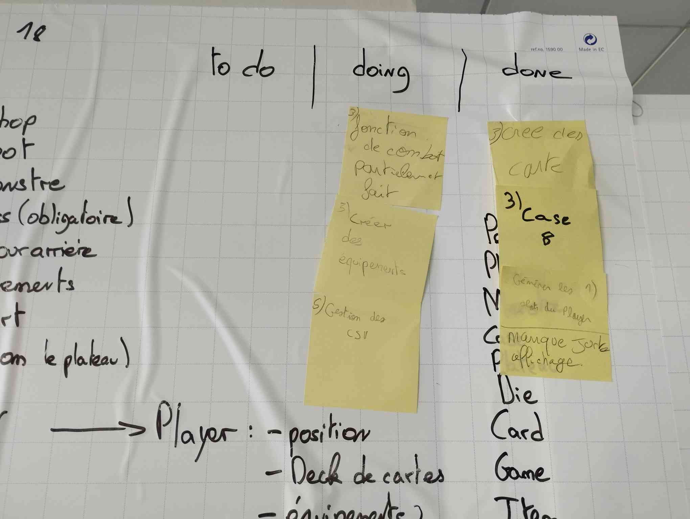

# Groupe 18 - Sprint 1

## Sprint 1

### Ce qui s'est passé lors de ce sprint :

Ce que nous avons accompli lors de ce sprint, c'est la première partie de la création d'un menu pour l'utilisateur.

### Ce que nous allons faire durant le prochain sprint :

Pour le prochain sprint, nous nous sommes engagés à terminer le menu et à créer un ASCII art pour le nom du jeu. Nous avons également commencé la vue du plateau du jeu et mis en place les fonctions permettant de monter de niveau et de lancer les dés pour avancer.

## Rétrospective

Nous avons bénéficié d'une bonne organisation dès le début du sprint, ainsi que d'une communication efficace tout au long des autres sprints.

### Sur quoi avons-nous buté ?

Lors du premier sprint, nous avons rencontré des problèmes de conflits avec Git, ce qui a retardé notre avancée sur les tâches à accomplir.

### PDCA

L'élément que nous souhaitions améliorer était le menu pour le rendre plus fonctionnel. Ce que nous souhaitons améliorer, c'est la gestion de Git.

# Mémo

## Sprint 2

### Ce qui s'est passé lors de ce sprint :

Nous avons réussi à finaliser le menu pour accéder au jeu (créer une nouvelle partie...). Nous avons également ajouté l'affichage du nom du jeu au démarrage du jeu et accompli les tâches auxquelles nous nous étions engagés lors du sprint précédent.

### Ce que nous allons faire durant le prochain sprint :

Pour le prochain sprint, nous nous engageons à terminer la vue du plateau du jeu, à gérer les cases du plateau, et à implémenter la fonction ramenant le joueur au menu principal lorsqu'il perd.

## Rétrospective

Nous avons maintenu une bonne organisation dès le début du sprint, ainsi qu'une communication efficace tout au long des autres sprints.

### Sur quoi avons-nous buté ?

Nous avons rencontré des difficultés en raison du manque de membres au sein du groupe, ce qui aurait pu accélérer notre progression.

## PDCA

...

# Mémo

## Sprint 3

### Ce qui s'est passé lors de ce sprint :

Nous avons accompli tout ce qui était prévu lors de ce sprint :
* Terminer le plateau du jeu,
* Gérer les cases,
* Implémenter la fonction de game over.

### Ce que nous allons faire durant le prochain sprint :

Nous nous engageons à réaliser :
* La partie combat du jeu,
* La création de cartes magiques,
* La création d'équipements,
* La gestion des fichiers CSV,
* La génération des emplacements du joueur.

## Rétrospective

Nous avons maintenu une bonne organisation dès le début du sprint, avec une forte entraide au sein du groupe, ainsi qu'une communication efficace tout au long des autres sprints.

### Sur quoi avons-nous buté ?

Nous n'avons rencontré aucune difficulté lors de ce sprint.

# Mémo

## Sprint 4

### Ce qui s'est passé lors de ce sprint :

Lors de ce sprint, il était difficile de terminer le reste des tâches prévues malgré notre engagement. Cependant, nous avons réussi à accomplir les éléments suivants :
* La création de cartes magiques,
* La création d'une nouvelle case sur le plateau,
* La génération des emplacements.

### Ce que nous allons faire durant le prochain sprint :

Pour le prochain sprint, nous nous engageons à terminer les tâches non effectuées lors du sprint précédent.

## Rétrospective

Nous avons maintenu une bonne organisation dès le début du sprint, avec une forte entraide au sein du groupe, ainsi qu'une communication efficace tout au long des autres sprints.

### Sur quoi avons-nous buté ?

Nous avons rencontré des difficultés car nous nous sommes engagés à accomplir trop de tâches, et avec le manque de temps, nous n'avons pu en réaliser que la moitié.

## PDCA

...

# Mémo

## Sprint 5

### Ce qui s'est passé lors de ce sprint :

Lors de ce sprint, nous avons terminé les tâches non effectuées lors du sprint précédent, respectant ainsi notre engagement initial, qui consistait à :
* Gérer les fichiers CSV,
* Créer des équipements,
* Implémenter la fonction de combat.

### Ce que nous allons faire durant le prochain sprint :

Pour le prochain sprint, nous nous engageons à :
* Travailler sur le visuel pour le magasin,
* Créer le menu du magasin,
* Utiliser les cartes magiques,
* Mettre en place des récompenses à chaque tour,
* Permettre l'achat d'articles dans le magasin.

## Rétrospective

Nous avons maintenu une bonne organisation dès le début du sprint, avec une forte entraide au sein du groupe, ainsi qu'une communication efficace tout au long des autres sprints.

### Sur quoi avons-nous buté ?

Nous n'avons rencontré aucune difficulté majeure lors de ce sprint.

# Mémo

## Sprint 6

### Ce qui s'est passé lors de ce sprint :

Lors de ce sprint, nous n'avons pas réussi à respecter l'engagement pris lors du sprint précédent, qui consistait à réaliser :
* Le visuel pour le magasin,
* Le menu du magasin,
* L'utilisation des cartes magiques,
* Les récompenses à chaque tour,
* L'achat d'articles dans le magasin.

Cependant, nous avons tout de même réussi à accomplir les tâches suivantes :
* Le visuel pour le magasin,
* L'achat d'articles dans le magasin,
* Le visuel des monstres.

### Ce que nous allons faire durant le prochain sprint :

Pour le prochain sprint, nous nous engageons à réaliser :
* L'utilisation des cartes magiques,
* Les récompenses à chaque tour,
* La création des objets,
* La génération de dés aléatoires,
* Le visuel du magasin,
* Le système de faiblesses.

## Rétrospective

Nous avons maintenu une bonne organisation dès le début du sprint, avec une forte entraide au sein du groupe, ainsi qu'une communication efficace tout au long des autres sprints.

### Sur quoi avons-nous buté ?

Nous avons rencontré des difficultés avec nos machines, ce qui nous a pris du temps pour résoudre différents problèmes.

## PDCA

...

# Mémo

## Sprint 7

### Ce qui s'est passé lors de ce sprint :

Lors de ce sprint, nous n'avons pas réussi à respecter l'engagement pris lors du sprint précédent, qui consistait à :
* Utiliser des cartes magiques,
* Avoir des récompenses à chaque tour,
* Créer des objets,
* Générer des dés aléatoires,
* Créer un visuel du magasin,
* Mettre en place un système de faiblesses.

Cependant, il ne manquait que le visuel du magasin pour accomplir l'ensemble des tâches.

### Ce que nous allons faire durant le prochain sprint :

Pour le prochain sprint, nous nous engageons à réaliser :
* Le menu fonctionnel pour le magasin,
* Résoudre les bugs,
* Gérer les objets,
* Refaire l'UML au format numérique.

## Rétrospective

Nous avons maintenu une bonne organisation dès le début du sprint, avec une forte entraide au sein du groupe, ainsi qu'une communication efficace tout au long des autres sprints.

### Sur quoi avons-nous buté ?

Nous n'avons pas eu de grandes difficultés, mais nous avons manqué de temps.

## PDCA

...

# Mémo

# Sprint 8

## Ce que nous avons fait durant ce sprint :

Durant ce sprint, nous avons réalisé les actions suivantes :
* Nous avons réalisé le menu du magasin.
* Nous avons avancé sur l'affichage.
* Nous nous sommes occupés de la gestion des équipements, des objets et des cartes.
* Enfin, il nous restait des bugs à résoudre et l'UML à remettre au propre, mais nous n'avons pas eu le temps de nous en occuper durant ce sprint.

### Ce que nous allons faire durant le prochain sprint :

Pour le dernier sprint, il ne nous reste donc plus qu'à mettre l'UML au propre, corriger les bugs et créer les classes de test.

## Rétrospective

Nous avons maintenu une bonne organisation dès le début du sprint, avec une forte entraide au sein du groupe, ainsi qu'une communication efficace tout au long des autres sprints.

### Sur quoi avons-nous buté ?

Nous avons eu du mal à terminer nos tâches à temps à cause des bugs que nous avons rencontrés à la dernière minute, et nous avons eu du mal à terminer notre jeu à temps, notamment parce que nous n'étions que quatre personnes dans le groupe.

### PDCA

...

# Mémo

# Sprint 9

## Ce que nous avons fait durant ce sprint :

Durant ce sprint, nous avons réalisé les actions suivantes :
* Nous avons mis au propre l'UML.
* Nous avons créé des classes de test unitaires.
* Nous avons corrigé la majorité des bugs présents dans le programme.

## Rétrospective

Nous avons maintenu une bonne organisation dès le début du sprint, avec une forte entraide au sein du groupe, ainsi qu'une communication efficace tout au long des autres sprints.

### Sur quoi avons-nous buté ?

Nous avons rencontré des difficultés pour terminer nos tâches à temps en raison des bugs que nous avons rencontrés à la dernière minute, et nous avons eu du mal à terminer notre jeu à temps, notamment parce que nous étions seulement quatre personnes dans le groupe.

### PDCA

...

# Mémo

# Backlog

